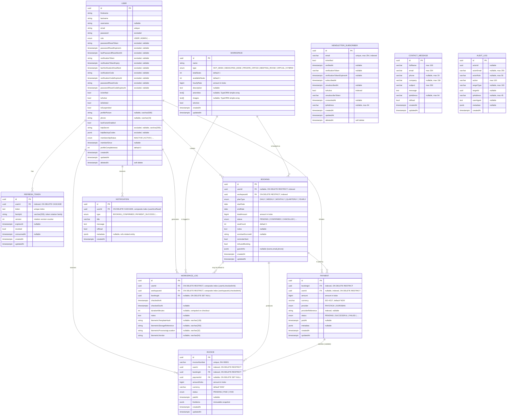

# NovaLabs — PostgreSQL Data Model

> **Source of truth:** this document is hand-maintained from the TypeORM entities under
> `backend/src/**/entities/*.entity.ts`. The **CI "Verify Data Model Sync" job** in
> `.github/workflows/CI.yaml` fails any pull request that modifies a `.entity.ts` file
> without also updating this file.
>
> **Maintainers' rule:** every PR that adds, removes, or renames a column, table, or
> relationship must update the corresponding section below. Reviewers should block
> merges that change entities but leave this document untouched.

---

## 1. Entity-Relationship Overview

---

## 2. Enumerations

### `UserRole`
| Value | Description |
|---|---|
| `super_admin` | Full system access |
| `admin` | Administrative access |
| `staff` | Staff-level access |
| `user` | Regular platform user (default) |

### `MembershipStatus`
| Value | Description |
|---|---|
| `active` | Active member |
| `inactive` | Not a member (default) |
| `suspended` | Membership suspended |

### `WorkspaceType`
| Value | Description |
|---|---|
| `HotDesk` | Unassigned hot desk |
| `DedicatedDesk` | Assigned dedicated desk |
| `PrivateOffice` | Private office space |
| `MeetingRoom` | Meeting/conference room |
| `Virtual` | Virtual office |
| `Hybrid` | Hybrid space |

### `PlanType`
| Value | Description |
|---|---|
| `daily` | Daily booking |
| `weekly` | Weekly booking |
| `monthly` | Monthly booking |
| `quarterly` | Quarterly subscription |
| `yearly` | Annual subscription |

### `BookingStatus`
| Value | Description |
|---|---|
| `pending` | Awaiting confirmation |
| `confirmed` | Booking confirmed |
| `cancelled` | Booking cancelled |
| `completed` | Booking completed |

### `PaymentProvider`
| Value | Description |
|---|---|
| `paystack` | Paystack (NGN fiat) |
| `soroban` | Soroban smart contract (Stellar) |

### `PaymentStatus`
| Value | Description |
|---|---|
| `pending` | Awaiting processing |
| `success` | Payment completed |
| `failed` | Payment failed |
| `refunded` | Payment refunded |

### `InvoiceStatus`
| Value | Description |
|---|---|
| `pending` | Unpaid |
| `paid` | Settled |
| `void` | Cancelled/voided |

### `NotificationType`
| Value | Description |
|---|---|
| `booking_confirmed` | Booking confirmed |
| `booking_cancelled` | Booking cancelled |
| `booking_completed` | Booking completed |
| `payment_success` | Payment successful |
| `payment_failed` | Payment failed |
| `payment_refunded` | Payment refunded |
| `invoice_generated` | New invoice |
| `general` | General notification |

### `AuditAction`
| Value | Description |
|---|---|
| `create` | Resource created |
| `update` | Resource updated |
| `delete` | Resource deleted |
| `refund` | Payment refunded |
| `login` | User logged in |
| `logout` | User logged out |
| `impersonate` | Admin impersonated a user |
| `cancel` | Booking cancelled |
| `auth.refresh.family.revoked` | Refresh token family revoked |

---

## 3. Relationship Cheat-Sheet

| From | Cardinality | To | Join column | On delete | Nullable |
|---|---|---|---|---|---|
| `User`        | 1 → 0..* | `RefreshToken`  | `refresh_tokens.userId`        | `CASCADE`  | no  |
| `User`        | 1 → 0..* | `Booking`       | `bookings.userId`             | `RESTRICT` | yes |
| `User`        | 1 → 0..* | `Payment`       | `payments.userId`             | `RESTRICT` | yes |
| `User`        | 1 → 0..* | `Invoice`       | `invoices.userId`             | `RESTRICT` | no  |
| `User`        | 1 → 0..* | `WorkspaceLog`  | `workspace_logs.userId`       | `RESTRICT` | no  |
| `User`        | 1 → 0..* | `Notification`  | `notifications.userId`        | `CASCADE`  | no  |
| `Workspace`   | 1 → 0..* | `Booking`       | `bookings.workspaceId`        | `RESTRICT` | no  |
| `Workspace`   | 1 → 0..* | `WorkspaceLog`  | `workspace_logs.workspaceId`  | `RESTRICT` | no  |
| `Booking`     | 1 → 0..* | `Payment`       | `payments.bookingId`          | `RESTRICT` | no  |
| `Booking`     | 1 → 0..* | `Invoice`       | `invoices.bookingId`          | `RESTRICT` | no  |
| `Booking`     | 1 → 0..* | `WorkspaceLog`  | `workspace_logs.bookingId`    | `SET NULL` | yes |
| `Payment`     | 1 → 0..1 | `Invoice`       | `invoices.paymentId`          | `SET NULL` | yes |

`NewsletterSubscriber`, `ContactMessage`, and `AuditLog` are intentionally standalone — they do
not reference any other table via TypeORM relationships and are isolated from the core user domain.

---

## 3. Index Summary

| Table | Index | Columns | Notes |
|---|---|---|---|
| `users`                  | PK                        | `id`            | uuid |
| `refresh_tokens`         | unique                    | `token`         | hashed |
| `refresh_tokens`         | unique                    | `familyId`, `version` | token rotation |
| `refresh_tokens`         | btree                     | `userId`        | |
| `refresh_tokens`         | btree                     | `familyId`      | |
| `bookings`               | btree                     | `userId`        | |
| `bookings`               | btree                     | `workspaceId`   | |
| `bookings`               | btree                     | `status`        | |
| `payments`               | btree                     | `bookingId`     | |
| `payments`               | btree                     | `userId`        | |
| `payments`               | btree                     | `providerReference` | |
| `invoices`               | unique                    | `invoiceNumber` | human-readable |
| `invoices`               | btree                     | `userId`        | |
| `invoices`               | btree                     | `bookingId`     | |
| `workspace_logs`         | composite                 | `workspaceId`, `checkedInAt` | |
| `workspace_logs`         | composite                 | `userId`, `checkedInAt`      | |
| `notifications`          | composite                 | `userId`, `isRead`           | |
| `newsletter_subscribers` | unique                    | `email`        | |
| `newsletter_subscribers` | btree                     | `email`        | |
| `newsletter_subscribers` | btree                     | `isActive`     | |
| `newsletter_subscribers` | btree                     | `isVerified`   | |

---

## 4. Conventions

- **Money:** all monetary amounts are stored in **kobo** (smallest currency unit) as
  `bigint` to avoid floating-point errors.
- **Timestamps:** `timestamptz` for absolute instants, `date` for calendar days
  (e.g. `Booking.startDate`).
- **Soft deletes:** `User` and `NewsletterSubscriber` use a `deletedAt` column
  driven by TypeORM's `@DeleteDateColumn`. All other tables hard-delete.
- **Excluded fields:** sensitive columns on `User` (password, OTP secrets, tokens)
  are decorated with `@Exclude()` so they are stripped from JSON responses.
  These columns exist in the database (with `varchar`/`text`/`jsonb`/`timestamptz`
  types as listed in the ER diagram) but never reach the API consumer.
- **Audit columns:** most entities expose `createdAt` / `updatedAt` via
  `@CreateDateColumn` / `@UpdateDateColumn`.
- **Cascade vs Restrict:** cascading deletes are reserved for strictly-owned rows
  (refresh tokens, notifications). Domain entities (`Booking`, `Payment`,
  `Invoice`, `WorkspaceLog`) refuse to delete their parent user/workspace to
  preserve audit trails — `RESTRICT` is enforced at the database level.
- **Biometric data:** `WorkspaceLog` stores only privacy-safe markers (hash,
  vendor reference, processing location) — never raw biometric templates.
  See [`docs/THREAT-MODEL.md`](../../docs/THREAT-MODEL.md) for the full threat model.

---

## 5. Keeping this document in sync

The CI workflow includes a **`verify-data-model`** job that:

1. Computes `git diff --name-only origin/main...HEAD`.
2. If any path matches `\.entity\.ts$` and **no** path matches
   `backend/docs/data-model\.md$`, the job fails with an `::error::` annotation.

To regenerate after a deliberate schema change, edit the Mermaid block above
and (if helpful) regenerate a visual preview with any Mermaid live editor before
committing.
