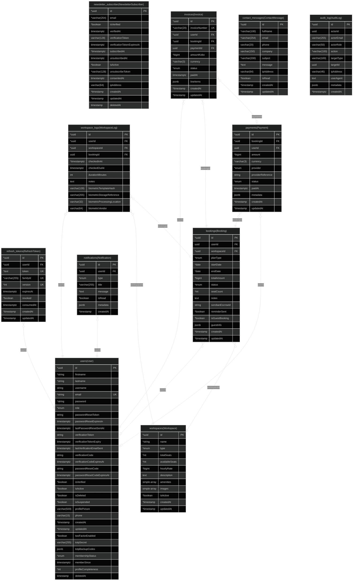

# backend

## ER Diagram

```mermaid
%%{init: {'theme':'dark'}}%%

erDiagram


"workspaces(Workspace)" {
  *uuid id    PK
  *string name
  *enum type
  *int totalSeats
  *int availableSeats
  *bigint hourlyRate
  text description
  simple-array amenities
  simple-array images
  *boolean isActive
  *timestamp createdAt
  *timestamp updatedAt
}


"refresh_tokens(RefreshToken)" {
  *uuid id    PK
  *uuid userId    FK
  *text token    UK
  *varchar(255) familyId    UK
  *int version    UK
  timestamptz expiresAt
  *boolean revoked
  timestamptz consumedAt
  *timestamp createdAt
  *timestamp updatedAt
}


"refresh_tokens(RefreshToken)"  }o  --  ||  "users(User)":  "userId"


"users(User)" {
  *uuid id    PK
  *string firstname
  *string lastname
  string username
  *string email    UK
  *string password
  *enum role
  string passwordResetToken
  timestamptz passwordResetExpiresIn
  timestamptz lastPasswordResetSentAt
  string verificationToken
  timestamptz verificationTokenExpiry
  timestamptz lastVerificationEmailSent
  string verificationCode
  timestamptz verificationCodeExpiresAt
  string passwordResetCode
  timestamptz passwordResetCodeExpiresAt
  *boolean isVerified
  *boolean isActive
  *boolean isDeleted
  *boolean isSuspended
  varchar(500) profilePicture
  varchar(15) phone
  *timestamp createdAt
  *timestamp updatedAt
  *boolean twoFactorEnabled
  varchar(255) totpSecret
  jsonb totpBackupCodes
  *enum membershipStatus
  timestamptz memberSince
  *int profileCompleteness
  timestamp deletedAt
}


"bookings(Booking)" {
  *uuid id    PK
  uuid userId    FK
  *uuid workspaceId    FK
  *enum planType
  *date startDate
  *date endDate
  *bigint totalAmount
  *enum status
  *int seatCount
  text notes
  string sorobanEscrowId
  *boolean reminderSent
  *boolean isGuestBooking
  jsonb guestInfo
  *timestamp createdAt
  *timestamp updatedAt
}


"bookings(Booking)"  }o  --  o|  "users(User)":  "userId"
"bookings(Booking)"  }o  --  ||  "workspaces(Workspace)":  "workspaceId"


"workspace_logs(WorkspaceLog)" {
  *uuid id    PK
  *uuid userId    FK
  *uuid workspaceId    FK
  uuid bookingId    FK
  *timestamptz checkedInAt
  timestamptz checkedOutAt
  int durationMinutes
  text notes
  varchar(128) biometricTemplateHash
  varchar(255) biometricStorageReference
  varchar(32) biometricProcessingLocation
  varchar(64) biometricVendor
}


"workspace_logs(WorkspaceLog)"  }o  --  ||  "users(User)":  "userId"
"workspace_logs(WorkspaceLog)"  }o  --  ||  "workspaces(Workspace)":  "workspaceId"
"workspace_logs(WorkspaceLog)"  }o  --  o|  "bookings(Booking)":  "bookingId"


"payments(Payment)" {
  *uuid id    PK
  *uuid bookingId    FK
  uuid userId    FK
  *bigint amount
  *varchar(3) currency
  *enum provider
  string providerReference
  *enum status
  timestamptz paidAt
  jsonb metadata
  *timestamp createdAt
  *timestamp updatedAt
}


"payments(Payment)"  }o  --  ||  "bookings(Booking)":  "bookingId"
"payments(Payment)"  }o  --  o|  "users(User)":  "userId"


"notifications(Notification)" {
  *uuid id    PK
  *uuid userId    FK
  *enum type
  *varchar(255) title
  *text message
  *boolean isRead
  jsonb metadata
  *timestamp createdAt
}


"notifications(Notification)"  }o  --  ||  "users(User)":  "userId"


"newsletter_subscriber(NewsletterSubscriber)" {
  *uuid id    PK
  *varchar(254) email
  *boolean isVerified
  timestamptz verifiedAt
  varchar(128) verificationToken
  timestamptz verificationTokenExpiresAt
  *timestamptz subscribedAt
  timestamptz unsubscribedAt
  *boolean isActive
  *varchar(128) unsubscribeToken
  timestamptz consentedAt
  varchar(64) ipAddress
  *timestamp createdAt
  *timestamp updatedAt
  timestamp deletedAt
}


"invoices(Invoice)" {
  *uuid id    PK
  *varchar(20) invoiceNumber    UK
  *uuid userId    FK
  *uuid bookingId    FK
  uuid paymentId    FK
  *bigint amountKobo
  *varchar(3) currency
  *enum status
  timestamptz paidAt
  jsonb lineItems
  *timestamp createdAt
  *timestamp updatedAt
}


"invoices(Invoice)"  }o  --  ||  "users(User)":  "userId"
"invoices(Invoice)"  }o  --  ||  "bookings(Booking)":  "bookingId"
"invoices(Invoice)"  }o  --  o|  "payments(Payment)":  "paymentId"


"contact_messages(ContactMessage)" {
  *uuid id    PK
  *varchar(100) fullName
  *varchar(254) email
  varchar(20) phone
  varchar(150) company
  *varchar(200) subject
  *text message
  varchar(64) ipAddress
  *boolean isRead
  *timestamp createdAt
  *timestamp updatedAt
}


"audit_log(AuditLog)" {
  *uuid id    PK
  uuid actorId
  varchar(255) actorEmail
  varchar(50) actorRole
  *varchar(100) action
  varchar(100) targetType
  uuid targetId
  varchar(45) ipAddress
  text userAgent
  jsonb metadata
  *timestamptz createdAt
}


```
